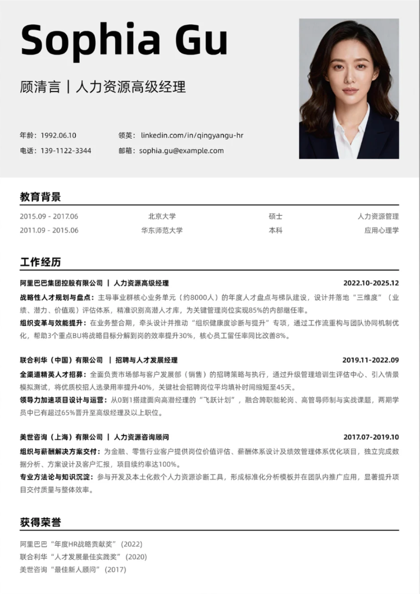
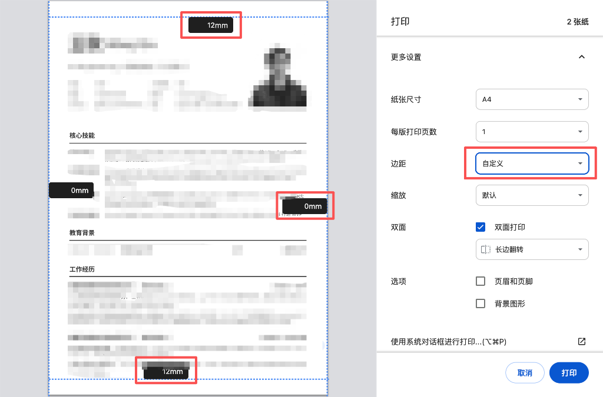

# Resume A4 Generator Skill

A premium, engineering-centric resume generation skill for AI Agents. It produces professional A4-sized resumes (HTML/CSS) with a focus on system architecture, engineering excellence, and clean design.

## 🚀 How to Use

To use this skill, simply instruct your AI assistant to:
> "Use the resume-a4-generator skill to generate/update my resume."

### 🔄 The Workflow
1.  **Language Confirmation**: The AI will first ask if you want the resume in **Chinese** or **English**.
2.  **Content Injection**: Provide your career details. The AI will use the structured templates to generate high-quality HTML.
3.  **Preview**: Open the generated HTML file in any modern browser (Chrome/Edge recommended).
4.  **Export**: Print to PDF using the specific settings below.

## 📄 Final Effect Reference
The skill is designed to achieve a premium "Architectural" feel, balanced for both HR readability and technical depth.

## 🖨️ PDF Export Settings (Crucial)
To ensure the resume fits perfectly on a single A4 page and maintains the intended padding, use the following settings in your browser's Print dialog:

1.  **Paper Size**: A4
2.  **Margins**: Select **Custom**.
3.  **Padding Values**:
    *   **Top/Bottom**: `12mm` (as shown in the guide)
    *   **Left/Right**: `0mm` (the HTML template already handles internal horizontal padding of 60px).
4.  **Options**: Uncheck "Headers and Footers" and "Background Graphics" (unless specialized shading is used).

## 📂 Repository Structure
- `SKILL.md`: Core instructions for the AI.
- `resources/template.html`: The main A4 layout.
- `resources/item-templates.html`: Detailed blocks for jobs, skills, and education.
- `resources/vibe-guide.md`: Guidance on tone and aesthetic principles.
